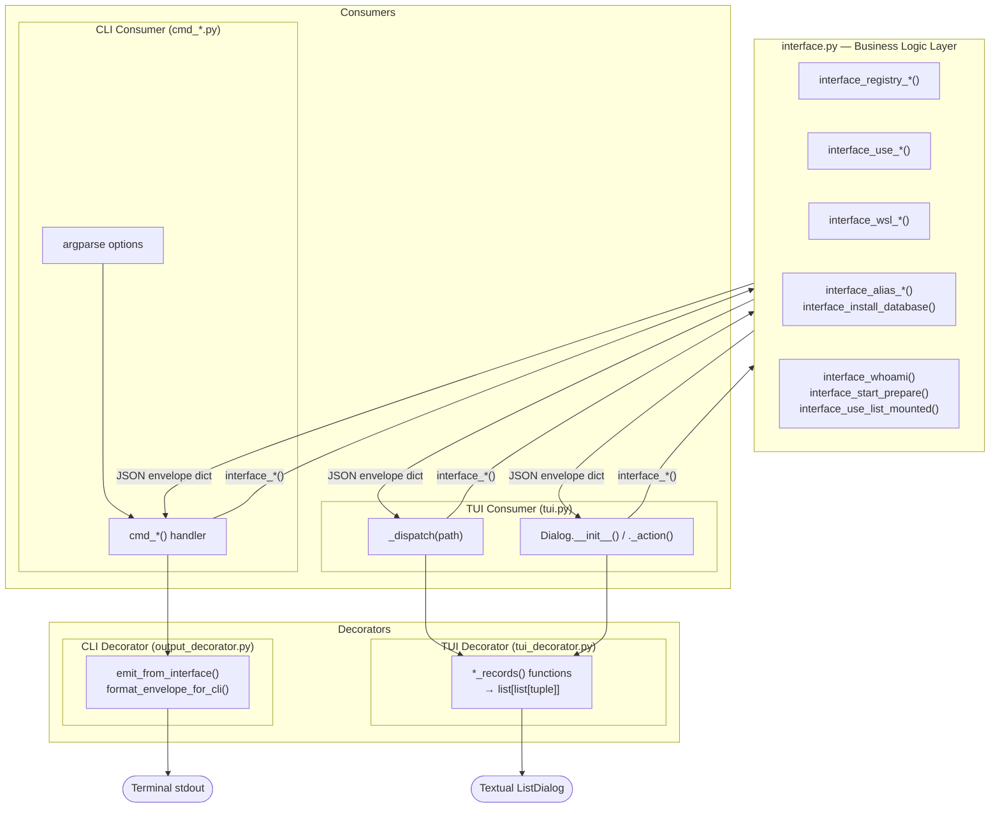
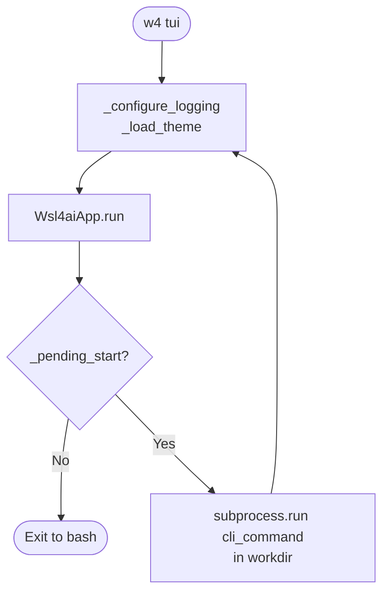

# WSL4AI — Architecture

This document describes the layered architecture introduced in v1.5.74, where CLI and TUI are thin consumers of a shared business-logic layer.

---

## 1. Layer overview

```
┌──────────────────────────────────────────────────────────────────┐
│                         Consumers                                │
│                                                                  │
│   CLI Consumer                     TUI Consumer                  │
│   cmd_*() handlers                 _dispatch() + Dialog classes  │
│   (use_commands.py, etc.)          (tui.py)                      │
└──────────────────┬──────────────────────────┬────────────────────┘
                   │                          │
                   ▼                          ▼
┌──────────────────────────────────────────────────────────────────┐
│                      interface.py                                │
│            Business logic — returns JSON envelope                │
│  interface_registry_*  interface_use_*  interface_wsl_*          │
│  interface_alias_*     interface_install_*  interface_whoami()   │
│  interface_start_prepare()  interface_use_list_mounted()         │
└──────────────────┬──────────────────────────┬────────────────────┘
                   │                          │
                   ▼                          ▼
┌─────────────────────────┐    ┌─────────────────────────────────┐
│    CLI Decorator         │    │         TUI Decorator           │
│  output_decorator.py     │    │       tui_decorator.py          │
│  format_envelope_for_cli │    │  registry_list_records()        │
│  emit_from_interface()   │    │  use_list_records()             │
│                          │    │  wsl_list_records()             │
│                          │    │  alias_list_records()           │
│                          │    │  use_list_mounted_records()     │
└──────────┬───────────────┘    └───────────────┬─────────────────┘
           │                                    │
           ▼                                    ▼
        stdout                          Textual widgets
    (JSON → human text)              (ListDialog / Form)
```

---

## 2. Architecture diagram



---

## 3. JSON envelope (shared contract)

Every `interface_*()` function returns a dict with this shape:

```json
{
  "runtimeId": { "machine": "...", "user": "..." },
  "input":     { "command": "...", "subcommand": "...", "options": [] },
  "output": {
    "result": { "status": 0, "message": "...", "uuid": "" },
    "data":   { "rows": [ { "fields": [ { "key": "k", "value": "v" } ] } ] }
  }
}
```

Helpers exposed by `interface.py`:

| Function | Returns |
|----------|---------|
| `status_of(env)` | `int` — `env["output"]["result"]["status"]` |
| `message_of(env)` | `str` — `env["output"]["result"]["message"]` |
| `rows_of(env)` | `list` — `env["output"]["data"]["rows"]` |
| `emit_from_interface(args, env, opts)` | `int` — patches opts into env, calls `emit_envelope()` |

---

## 4. TUI Decorator record format

`tui_decorator.*_records(envelope)` returns `(header: str, records: list[list[tuple[str,str]]])`.

Each record is a list of `(label, value)` pairs displayed as a form-style row in `ListDialog`:

```python
[
  ("UUID     ", "550e8400-..."),
  ("Name     ", "myproject"),
  ("Path Host", "/mnt/c/LocalFiles/proyectos/myproject"),
  ("Path Wsl ", "/home/user/wsl4ai/proyectos/myproject"),
  ("In Use   ", "yes"),
]
```

---

## 5. TUI loop (cmd_tui)

After selecting **Start** in the TUI, the app exits and `cmd_tui` launches the configured CLI tool. When that tool exits, `cmd_tui` relaunches the TUI automatically. The loop only exits when the user quits the TUI without selecting Start.



---

## 6. File map

| File | Role |
|------|------|
| `tool/wsl4ai.py` | Entrypoint, version, argument parser |
| `tool/commands/interface.py` | Business logic layer |
| `tool/commands/tui_decorator.py` | TUI record converters |
| `tool/commands/tui.py` | Textual TUI — menus, dialogs, cmd_tui |
| `tool/commands/output_decorator.py` | CLI envelope formatter |
| `tool/commands/add_remove.py` | CLI: registry add/remove |
| `tool/commands/list_registry.py` | CLI: registry list |
| `tool/commands/use_commands.py` | CLI: use subcommands |
| `tool/commands/wsl_cli.py` | CLI: wsl subcommands |
| `tool/commands/install_database.py` | CLI: install database |
| `tool/commands/install_alias.py` | CLI: install alias |
| `tool/commands/install_update.py` | CLI: install update |
| `tool/commands/whoami.py` | CLI: whoami |
| `tool/commands/start.py` | CLI: start |
| `tool/commands/common.py` | DB path, path helpers, RuntimeIdentity |
| `tool/commands/wsl_db.py` | DB helpers: resolve_registry_target, resolve_wsl_uuid |
| `tool/commands/api_json.py` | Envelope builders, OptionSpec |
| `conf/config.json` | TUI theme + log config |
| `conf/local.env` | HOST_PROJECTS, WSL_PROJECTS |
