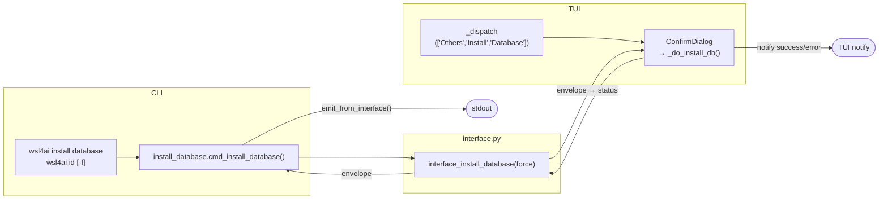

# Specification: `wsl4ai install ...`

Command group for setup and shell integration tasks.

---

## 1. Subcommands

| Subcommand | Shortcut | Purpose |
|------------|----------|---------|
| `install database` | `id` | Create the database if missing; `--force` for destructive reset |
| `install alias` | `ia` | Add/remove/list shell aliases in Bash or PowerShell profile |
| `install update` | `iu` | Check for and apply a new version of the tool from GitHub |

> **Note:** `install tool` and its shortcut `it` have been removed. Layout validation is no longer a standalone command.

---

## 2. `install database`

- Invocation: `wsl4ai install database [-f]` · `wsl4ai id [-f]`
- Purpose: initialize database or reset it.
- Output contract: always `output.result`.

### Options

| Flag | Long | Metavar | Required | Description |
|------|------|---------|----------|-------------|
| `-f` | `--force` | — | no | Overwrite existing database (destructive reset) |



### SQLite journal mode — shared v9fs mount compatibility

The database uses `PRAGMA journal_mode=DELETE` (not WAL).

**Why not WAL:** WAL mode requires a `-shm` file (OS-level shared memory) alongside the `.db`. On a v9fs filesystem — the type used by Windows-backed mounts in WSL2 (`mount --bind /mnt/c/...`) — the shared memory mechanism does not work correctly across machines. Symptom: `sqlite3.OperationalError: unable to open database file` when opening a WAL-mode DB from any machine other than the one that created it.

**Implementation rule:** `connect_db()` in `common.py` always sets `journal_mode=DELETE`. Do not switch to WAL even for better concurrency — the deployment scenario is a single DB on a shared mount accessed by multiple WSL instances.

**Migrating existing WAL databases:** A DB created with WAL (versions prior to v1.6.2) cannot be opened directly from v9fs. Recovery procedure:

```bash
# Copy to native Linux filesystem, migrate, copy back
cp /path/to/mount/wsl4ai.db /tmp/migrate.db
python3 -c "
import sqlite3
con = sqlite3.connect('/tmp/migrate.db')
con.execute('PRAGMA journal_mode=DELETE;')
con.commit()
con.close()
"
cp /tmp/migrate.db /path/to/mount/wsl4ai.db
rm /tmp/migrate.db
```

---

## 3. `install alias`

- Invocation: `wsl4ai install alias -a <action> [-n <name>] ...` · `wsl4ai ia ...`
- Purpose: add/remove/list aliases in shell profile targets.
- Target file: `~/.startup-wsl4ai.sh` (Linux) or PowerShell profile (Windows); auto-detected from OS — no `--type` option.
- Output contract: always `output.result`; `list` action includes `output.data.rows`.

### Options

| Flag | Long | Metavar | Required | Description |
|------|------|---------|----------|-------------|
| `-a` | `--action` | ACTION | **yes** | Operation: `list` · `add` · `remove` |
| `-n` | `--name` | NAME | for add/remove | Alias name (repeatable; multiple `-n name` allowed) |

- Validation rules:
  - `add`: existing alias → error
  - `remove`: missing alias → error
  - `list`: no `--name` required; returns all aliases in the managed block
- Aliases are managed inside the markers block:
  ```
  # >>> WSL4AI BEGIN >>>
  ...
  # <<< WSL4AI END <<<
  ```
- Output contract: always `output.result`; `list` action includes `output.data.rows`.


---

## 4. `install update`

- Invocation: `wsl4ai install update [--check]` · `wsl4ai iu [--check]`
- Purpose: check for and apply a new version of the tool from GitHub.
- Output contract: plain text (not JSON — delegated to external script).
- **TUI**: not available; CLI-only.

### Options

| Flag | Long | Metavar | Required | Description |
|------|------|---------|----------|-------------|
| — | `--check` | — | no | Print available version without applying the update |

Behavior:
1. Delegates immediately to `conf/wsl4ai-update.py` via `os.execv`.
2. The updater downloads `wsl4ai.py` from GitHub to extract the remote `__version__`.
3. If remote version is not superior, exits with no changes.
4. With `--check`: prints available version and exits.
5. If updating: clones repository to `.tmp/`, replaces `tool/`, cleans up. `conf/` is never touched.


