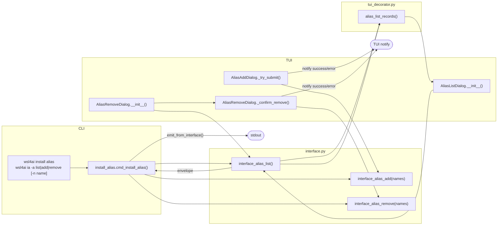
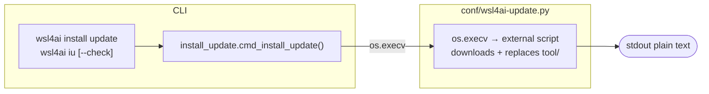

# Specification: `wsl4ai install ...`

Command group for setup and shell integration tasks.

---

## 1. Subcommands

| Subcommand | Shortcut | Purpose |
|------------|----------|---------|
| `install database` | `id` | Create the database if missing; `--force` for destructive reset |
| `install alias` | `ia` | Add/remove/list shell aliases in Bash or PowerShell profile |
| `install update` | `iu` | Check for and apply a new version of the tool from GitHub |

> **Note:** `install tool` and its shortcut `it` have been removed. Layout validation is no longer a standalone command.

---

## 2. `install database`

- Purpose: initialize database or reset it.
- Options: optional `-f/--force` for destructive overwrite.
- Output contract: always `output.result`.


---

## 3. `install alias`

- Purpose: add/remove/list aliases in shell profile targets.
- Target file: `~/.startup-wsl4ai.sh` (Linux) or PowerShell profile (Windows); auto-detected from OS — no `--type` option.
- Required options:
  - `-a/--action` → `add|remove|list`
  - `-n/--name` → repeatable alias names (required only for `add` and `remove`)
- Validation rules:
  - `add`: existing alias → error
  - `remove`: missing alias → error
  - `list`: no `--name` required; returns all aliases in the managed block
- Aliases are managed inside the markers block:
  ```
  # >>> WSL4AI BEGIN >>>
  ...
  # <<< WSL4AI END <<<
  ```
- Output contract: always `output.result`; `list` action includes `output.data.rows`.



---

## 4. `install update`

- Purpose: check for and apply a new version of the tool from GitHub.
- Options: optional `--check` — print available version without applying the update.
- Behavior:
  1. Delegates immediately to `conf/wsl4ai-update.py` via `os.execv`.
  2. The updater downloads `wsl4ai.py` from GitHub to extract the remote `__version__`.
  3. If remote version is not superior, exits with no changes.
  4. With `--check`: prints available version and exits.
  5. If updating: clones repository to `.tmp/`, replaces `tool/`, cleans up. `conf/` is never touched.
- Output contract: plain text (not JSON — delegated to external script).
- **TUI**: not available; CLI-only.


