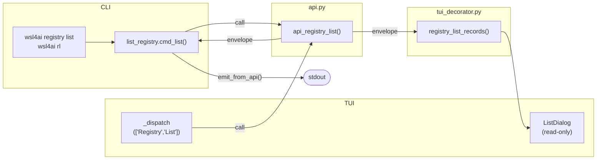
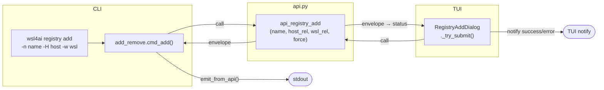
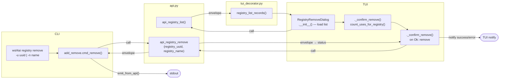

# Specification: `wsl4ai registry ...`

Command group for registry lifecycle management.

---

## 1. Subcommands

| Subcommand | Shortcut | Purpose |
|------------|----------|---------|
| `registry list` | `rl` | List all registries with resolved paths and in-use status |
| `registry add` | `ra` | Insert a new registry definition |
| `registry remove` | `rr` | Delete a registry (only if no use links exist) |

Scope rule: `registry` is global and does not expose WSL target selectors (`--wsl-uuid` / `--wsl-name` are not part of this command group).

---

## 2. `registry list`

Purpose: query registry rows with resolved full paths and linked usage information.

- Invocation: `wsl4ai registry list` · `wsl4ai rl`
- Output contract: always `output.result` + `output.data.rows` (query operation).

### Options

None.

Behavior:

1. Requires database file (`conf/ddbb/wsl4ai.db`).
2. Reads `registries` ordered by case-insensitive name.
3. Resolves host/wsl display paths from `conf/local.env` (`HOST_PROJECTS`, `WSL_PROJECTS`) with path-template expansion.
4. For each registry, checks if any `uses` row exists (in-use indicator).
5. Empty set is valid success (`status=0` with empty rows).

Row fields: `registryUuid`, `registryName`, `hostPath`, `wslPath`, `inUse`.

---

## 3. `registry add`

Purpose: insert one registry definition (DB only — no filesystem changes at this stage).

- Invocation: `wsl4ai registry add -n <name> -H <host_rel> -w <wsl_rel> [-f]` · `wsl4ai ra ...`
- Output contract: always `output.result`; `output.result.uuid` contains the new UUID.

### Options

| Flag | Long | Metavar | Required | Description |
|------|------|---------|----------|-------------|
| `-n` | `--name` | NAME | **yes** | Name for the registry (case-insensitive unique) |
| `-H` | `--host` | PATH | **yes** | Host-side folder segment appended to `HOST_PROJECTS` |
| `-w` | `--wsl` | PATH | **yes** | WSL-side folder segment appended to `WSL_PROJECTS` |
| `-f` | `--force` | — | no | Skip host-path existence check |

Rules:

- Required values must be non-empty after trim.
- Name uniqueness is case-insensitive.
- Without `--force`, the resolved absolute host path (`HOST_PROJECTS/rel_path_host`) must exist on disk.
- Insert target table: `registries` (`uuid`, `name`, `rel_path_host`, `rel_path_wsl`).
- **No filesystem changes**: directory creation happens in `use add`.

---

## 4. `registry remove`

Purpose: remove one registry row when no active use links exist.

- Invocation: `wsl4ai registry remove (-u <uuid> | -n <name>)` · `wsl4ai rr ...`
- Output contract: always `output.result`.

### Options

| Flag | Long | Metavar | Required | Description |
|------|------|---------|----------|-------------|
| `-u` | `--uuid` | UUID | one of -u / -n | Select registry by UUID |
| `-n` | `--name` | NAME | one of -u / -n | Select registry by name (case-insensitive) |

At least one of `-u` / `-n` must be provided. If both are given, `-u` takes precedence.

Rules:

- If any `uses` row references the target registry, removal is rejected — run `use disable` + `use remove` for all links first.
- If no links: `DELETE FROM registries`.
- **No filesystem changes**: `registry remove` only deletes from DB.

