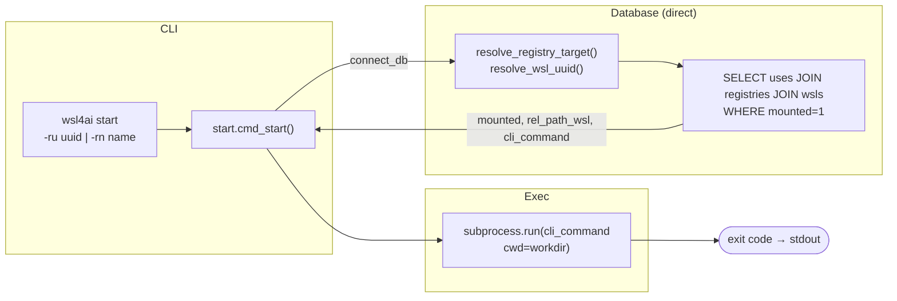
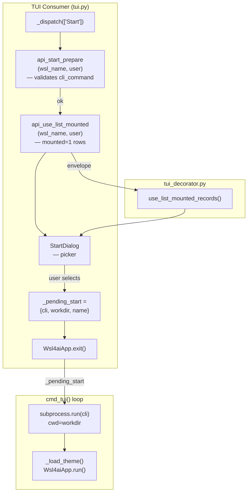

# Specification: `wsl4ai start`

Launch one concrete mounted `use` in the current terminal session.

---

## 1. Purpose

`start` resolves a single `uses` link, changes directory to the resolved WSL path, and executes the target WSL `cli_command`.

---

## 2. CLI: inputs and target resolution

- Invocation: `wsl4ai start (-ru <uuid> | -rn <name>) [-wu <uuid> | -wn <name>]`

### Options

| Flag | Long | Metavar | Required | Description |
|------|------|---------|----------|-------------|
| `-ru` | `--registry-uuid` | UUID | one of -ru/-rn | Registry UUID of the use to start |
| `-rn` | `--registry-name` | NAME | one of -ru/-rn | Registry name of the use to start |
| `-wu` | `--wsl-uuid` | UUID | no | Target WSL UUID (default: runtime WSL) |
| `-wn` | `--wsl-name` | NAME | no | Target WSL name (default: runtime WSL) |

If WSL selector is omitted, runtime identity is used (`RuntimeIdentity` → runtime `wsl_name` + runtime `user`).

This identifies one concrete `use`: (`wsl_uuid`, `registry_uuid`).

---

## 3. Security and execution rules (normative)

1. The `use` row must exist; otherwise fail.
2. The `use` row must have `mounted=1`; otherwise fail (security gate).
3. The working directory is resolved as: `WSL_PROJECTS` (from `local.env`) + `rel_path_wsl` (from selected `registry`).
4. `wsls.cli_command` for the resolved `wsl_uuid` must be non-empty; otherwise fail.
5. Execution mode is foreground in the same terminal session (not detached).
6. TUI-triggered `start` also runs in the same console session.

The command is fail-closed: any missing/invalid dependency prevents execution.

---

## 4. Output contract

- Always `output.result`
- No `output.data` (action command)
- `output.result.status`: `0` on success, non-zero for validation errors or subprocess failure

---

## 5. CLI flow

The CLI `start` command accesses the database directly (does not use the api layer).

---

## 6. TUI flow

In the TUI, **Start** is a menu item (not a dialog with selectors). It shows all `mounted=1` uses for the runtime WSL. After the user selects one and confirms, the TUI exits and `cmd_tui` runs the tool. When the tool exits, the TUI relaunches automatically.

