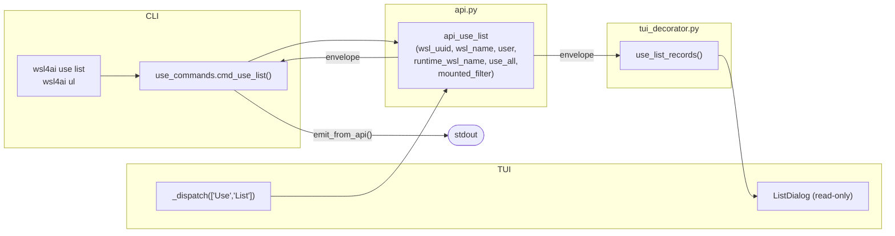
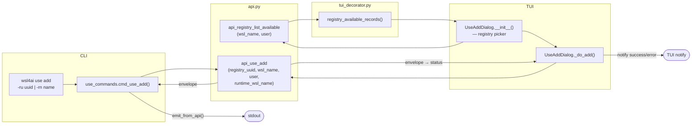
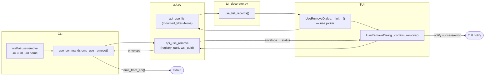
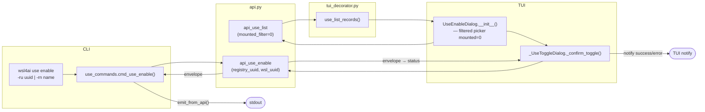
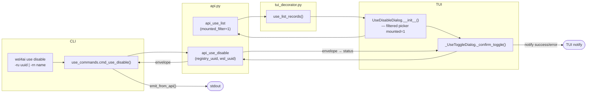
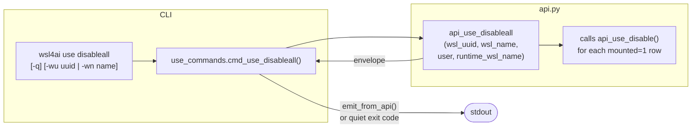

# Specification: `wsl4ai use ...`

Core (non-special) commands. Align with **[`specs.md`](specs.md)** §2. Implementation: [`commands/use_commands.py`](../commands/use_commands.py), [`commands/api.py`](../commands/api.py), [`commands/wsl_db.py`](../commands/wsl_db.py). WSL resolution uses **`RuntimeIdentity`** (`args.runtime_identity`: `machine`, `user`, `wsl_name` from `WSL_DISTRO_NAME` or `default`).

---

## 0. Lifecycle and filesystem ownership

The lifecycle of a use link follows a strict state machine. Each step owns specific filesystem and DB operations. **Order is critical — incorrect order can cause irreversible data loss on the Windows host.**

| Step | Command | Filesystem | DB | Precondition |
|------|---------|------------|-----|--------------|
| 1 | `registry add` | none | insert registry | — |
| 2 | `use add` | `mkdir -p WSL_PROJECTS/rel_wsl` | insert use (`mounted=0`) | registry exists |
| 3 | `use enable` | `sudo mount --bind host wsl` | set `mounted=1` | `mounted=0` |
| 4 | `use disable` | `sudo umount wsl` | set `mounted=0` | `mounted=1` |
| 5 | `use remove` | `rmtree WSL_PROJECTS/rel_wsl` | delete use row | `mounted=0` |
| 6 | `registry remove` | none | delete registry row | no use links |

> **`disable` does not remove the directory.** The WSL mount point is preserved so `enable` can be called again. Only `use remove` deletes the directory.

> **CRITICAL — data loss prevention:** `use remove` calls `rmtree` only when `mounted=0`. If called while mounted, it would delete content on the **Windows host** irreversibly. The `mounted=1` guard must never be bypassed.

---

## 1. Shared flags

### 1.1 Registry selector (required for `add`, `remove`, `enable`, `disable`)

| Flag | Long | Metavar | Description |
|------|------|---------|-------------|
| `-ru` | `--registry-uuid` | UUID | Select registry by UUID |
| `-rn` | `--registry-name` | NAME | Select registry by name (case-insensitive) |

Exactly one of `-ru` / `-rn` must be provided.

### 1.2 WSL selector (optional for all subcommands except `list`)

| Flag | Long | Metavar | Description |
|------|------|---------|-------------|
| `-wu` | `--wsl-uuid` | UUID | Target WSL by UUID |
| `-wn` | `--wsl-name` | NAME | Target WSL by name |

At most one may be provided. If omitted, the target is resolved from runtime identity (`wsl_name` + `user`). Follows the global rule in [`specs.md`](specs.md) §2.1.a.

---

## 2. `use list`

Query all usage links (`uses` rows) with joined registry/WSL context.

- Invocation: `wsl4ai use list` · `wsl4ai ul`
- Output contract: always `output.result` + `output.data.rows`.

### Options

| Flag | Long | Metavar | Required | Description |
|------|------|---------|----------|-------------|
| `-wu` | `--wsl-uuid` | UUID | no | Filter by WSL UUID (mutually exclusive with `-a`) |
| `-wn` | `--wsl-name` | NAME | no | Filter by WSL name (mutually exclusive with `-a`) |
| `-a` | `--all` | — | no | List links for **all** WSLs; cannot combine with `-wu`/`-wn`; **CLI-only** |

Default (no filter): scoped to runtime WSL.

Row fields: `wslUuid`, `wslName`, `wslUser`, `registryUuid`, `registryName`, `mounted`.

---

## 3. `use add`

- Invocation: `wsl4ai use add (-ru <uuid> | -rn <name>) [-wu <uuid> | -wn <name>]` · `wsl4ai ua ...`
- Output contract: always `output.result`; `output.result.uuid` contains the new `uses` row UUID.

### Options

| Flag | Long | Metavar | Required | Description |
|------|------|---------|----------|-------------|
| `-ru` | `--registry-uuid` | UUID | one of -ru/-rn | Registry UUID to link |
| `-rn` | `--registry-name` | NAME | one of -ru/-rn | Registry name to link |
| `-wu` | `--wsl-uuid` | UUID | no | Target WSL UUID (default: runtime WSL) |
| `-wn` | `--wsl-name` | NAME | no | Target WSL name (default: runtime WSL) |

**Execution order (strict):**
1. Resolve `registry_uuid`. Resolve `wsl_uuid` via `resolve_wsl_uuid` with **`create_if_missing=True`**: insert **`wsls`** (`cli_command NULL`) if missing.
2. If **`uses`** already has `(wsl_uuid, registry_uuid)` → error.
3. **Create WSL directory**: `os.makedirs(WSL_PROJECTS/rel_path_wsl, exist_ok=True)`.
4. **`INSERT INTO uses (wsl_uuid, registry_uuid, mounted)`** with **`mounted=0`**.

---

## 4. `use remove`

- Invocation: `wsl4ai use remove (-ru <uuid> | -rn <name>) [-wu <uuid> | -wn <name>]` · `wsl4ai ur ...`
- Output contract: always `output.result`.

### Options

| Flag | Long | Metavar | Required | Description |
|------|------|---------|----------|-------------|
| `-ru` | `--registry-uuid` | UUID | one of -ru/-rn | Registry UUID to unlink |
| `-rn` | `--registry-name` | NAME | one of -ru/-rn | Registry name to unlink |
| `-wu` | `--wsl-uuid` | UUID | no | Target WSL UUID (default: runtime WSL) |
| `-wn` | `--wsl-name` | NAME | no | Target WSL name (default: runtime WSL) |

**Execution order (strict):**
1. Resolve `wsl_uuid` (no auto-create) and `registry_uuid`.
2. If no `uses` row → error.
3. If `mounted=1` → error (`use disable` first).
4. **Remove WSL directory**: `shutil.rmtree(WSL_PROJECTS/rel_path_wsl)`.
5. **`DELETE`** that `uses` row from DB.

---

## 5. `use enable`

Activates one `uses` link: bind-mounts the host path onto the existing WSL directory.

- Invocation: `wsl4ai use enable (-ru <uuid> | -rn <name>) [-wu <uuid> | -wn <name>]` · `wsl4ai ue ...`
- Output contract: always `output.result`.

### Options

| Flag | Long | Metavar | Required | Description |
|------|------|---------|----------|-------------|
| `-ru` | `--registry-uuid` | UUID | one of -ru/-rn | Registry UUID of the use to enable |
| `-rn` | `--registry-name` | NAME | one of -ru/-rn | Registry name of the use to enable |
| `-wu` | `--wsl-uuid` | UUID | no | Target WSL UUID (default: runtime WSL) |
| `-wn` | `--wsl-name` | NAME | no | Target WSL name (default: runtime WSL) |

**Precondition:** `mounted=0`. If `mounted=1` → error.

**Execution order (strict):**
1. Resolve `wsl_uuid` and `registry_uuid`; fetch `rel_path_host` and `rel_path_wsl`.
2. If `mounted=1` → error.
3. Resolve full paths from `local.env` (`HOST_PROJECTS` + `rel_path_host`, `WSL_PROJECTS` + `rel_path_wsl`).
4. Ensure `wsl_path` directory exists (`os.makedirs`).
5. **Mount**: `sudo mount --bind <host_path> <wsl_path>`. On failure → error (DB unchanged).
6. **Update DB**: `UPDATE uses SET mounted=1` — only on mount success.

---

## 6. `use disable`

Deactivates one `uses` link: unmounts. **The WSL directory is not removed.**

- Invocation: `wsl4ai use disable (-ru <uuid> | -rn <name>) [-wu <uuid> | -wn <name>]` · `wsl4ai ud ...`
- Output contract: always `output.result`.

### Options

| Flag | Long | Metavar | Required | Description |
|------|------|---------|----------|-------------|
| `-ru` | `--registry-uuid` | UUID | one of -ru/-rn | Registry UUID of the use to disable |
| `-rn` | `--registry-name` | NAME | one of -ru/-rn | Registry name of the use to disable |
| `-wu` | `--wsl-uuid` | UUID | no | Target WSL UUID (default: runtime WSL) |
| `-wn` | `--wsl-name` | NAME | no | Target WSL name (default: runtime WSL) |

**Precondition:** `mounted=1`. If `mounted=0` → error.

**Execution order (strict):**
1. Resolve `wsl_uuid` and `registry_uuid`; fetch `rel_path_wsl`.
2. If `mounted=0` → error.
3. Resolve full WSL path from `local.env`.
4. **Unmount**: `sudo umount <wsl_path>`. On failure → error (DB unchanged).
5. **Update DB**: `UPDATE uses SET mounted=0` — only on unmount success.

---

## 7. `use disableall`

Applies `use disable` logic to **all `mounted=1`** uses rows of the runtime WSL. **CLI-only — not available in TUI.**

- Invocation: `wsl4ai use disableall [-q] [-wu <uuid> | -wn <name>]` · `wsl4ai uda ...`
- Output contract: always `output.result` (unless `-q` suppresses all output).

### Options

| Flag | Long | Metavar | Required | Description |
|------|------|---------|----------|-------------|
| `-q` | `--quiet` | — | no | Suppress all output; return exit code only (`0`=all ok, `1`=any failure) |
| `-wu` | `--wsl-uuid` | UUID | no | Target WSL UUID (default: runtime WSL) |
| `-wn` | `--wsl-name` | NAME | no | Target WSL name (default: runtime WSL) |

Called automatically on session start via `.bashrc` with `--quiet`.

**Behavior:**
1. Resolve `wsl_uuid` from runtime identity (or from `-wu`/`-wn`).
2. Query all `mounted=1` uses rows for that `wsl_uuid`.
3. For each row: `sudo umount` → `UPDATE uses SET mounted=0`. Continues even if one fails.
4. Reports total disabled and any errors.

---

## 8. Implementation reference

- `commands/use_commands.py` — CLI thin wrappers, argparse.
- `commands/api.py` — `api_use_*()` business logic.
- `commands/tui_decorator.py` — `use_list_records()`, `use_list_mounted_records()`.
- `commands/wsl_db.py` — `resolve_wsl_uuid`, `resolve_registry_target`.
- `commands/common.py` — `load_local_env_paths`, `expand_path_template`.
