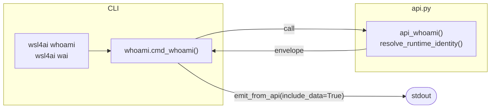

# Specification: `wsl4ai whoami` / `wsl4ai wai`

Runtime identity introspection command.

---

## 1. Purpose

Return the current runtime identity values:

- `machine` (runtime identifier per §1.3 of `specs.md`)
- `user` (effective account)

**CLI only** — not exposed in the TUI menu.

---

## 2. Options

- None.

---

## 3. Output contract

- Always `output.result`
- Includes `output.data.rows` with one record containing `machine` and `user`.

Although this is not a list command, it is treated as a data query by design.

---

## 4. Flow

