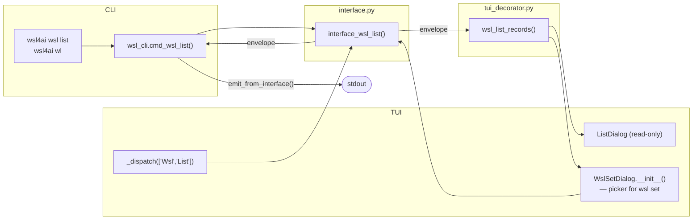
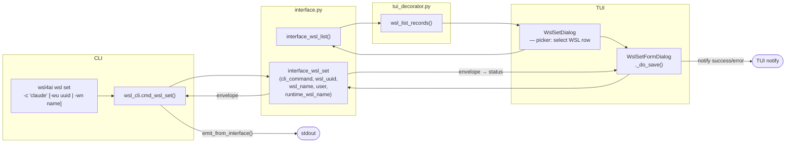

# Specification: `wsl4ai wsl ...`

Command group for WSL rows and per-WSL command settings.
This group follows the global optional-WSL rule in [`specs.md`](specs.md): if WSL selectors are omitted, runtime identity is used.

---

## 1. Subcommands

| Subcommand | Shortcut | Purpose |
|------------|----------|---------|
| `wsl list` | `wl` | List all known `wsls` rows and their `cli_command` values |
| `wsl set` | `ws` | Update `wsls.cli_command` for a target WSL row |

---

## 2. `wsl list`

- Purpose: query known `wsls` rows and `cli_command` values.
- Options: none.
- Output contract: always `output.result` + `output.data.rows`.

Row fields: `wslUuid`, `wslName`, `wslUser`, `cliCommand`.

---

## 3. `wsl set`

- Purpose: update `wsls.cli_command` for a target WSL row.
- Required options: `-c/--cli`
- Optional target selectors: `-wu/--wsl-uuid`, `-wn/--wsl-name`
- Default: resolved from runtime identity when selectors are omitted.
- Does not auto-create `wsls` rows.
- Output contract: always `output.result`.

